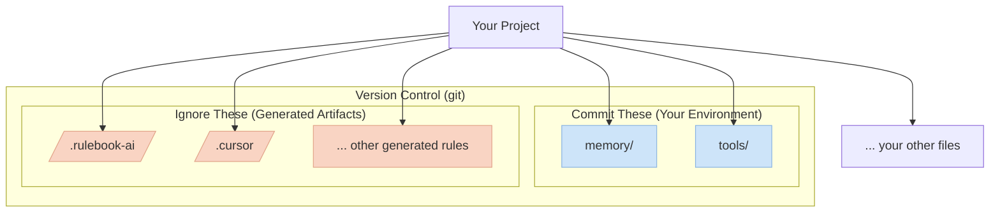

[](https://www.python.org/downloads/)
[](https://opensource.org/licenses/MIT)

- For bug report, use issues or use rulebook-ai command `rulebook-ai bug-report`
- For real-time chat, community support, and to share your ideas, [Join our Discord](https://discord.gg/aNmQB7JWPe) 
- Have specific feedback or want a personal demo? [Book a Chat on my Calendar](https://calendar.app.google/xx3S3CuKSBAt9d9Y7)

# Rulebook-AI: The AI Environment Manager

`rulebook-ai` is a command-line tool for packaging and deploying consistent, expert environments—**rules, context, and tools**—to your favorite AI coding assistants.

Stop wasting time re-explaining your project's architecture or manually copy-pasting instructions between different AIs. With `rulebook-ai`, you define your AI's environment once, and deploy it anywhere.

## The Problem: AI Assistants are Generic and Isolated

AI coding assistants are powerful, but they operate in a vacuum.
1.  **They are forgetful:** They have no long-term memory of your project's specific architecture, libraries, or goals.
2.  **They are inconsistent:** Instructions you give to `Cursor` don't work in `Gemini`, and your `Copilot` context is siloed.
3.  **They are unspecialized:** An AI's general knowledge is not enough for expert-level tasks. A great "React developer" AI needs different rules, context, and tools than a great "DevOps engineer" AI.

## The Solution: Portable and Composable AI Environments

`rulebook-ai` solves this by treating an AI's entire operational context as a portable **Environment** that you can manage like code. An Environment consists of three parts:
*   **Rules:** The AI's operating instructions and workflows.
*   **Context:** A persistent knowledge base (your project's "memory").
*   **Tools:** Helper scripts the AI can use to perform tasks.

These environments are packaged into versionable, shareable **Packs**.

### Why `rulebook-ai` is the Answer

| Value Proposition                  | How `rulebook-ai` Delivers                                                                                                                                                                                          |
| ---------------------------------- | ------------------------------------------------------------------------------------------------------------------------------------------------------------------------------------------------------------------- |
| **Portability Across Assistants**  | Define an environment once in a universal **Pack**. The `project sync` command automatically translates and deploys it to any supported AI (Cursor, Gemini, Copilot, etc.). Use the best AI for the job without losing context. |
| **Deep Specialization for Any Task** | Create or use packs for specific roles (**Product Manager, DevOps**) or technologies (**React, AWS, Data Science**). Instantly "onboard" your AI with the expert knowledge and tools it needs for the task at hand. |
| **Composable & Versionable Context** | Treat your AI's environment as code. Mix and match packs to build the perfect setup for any project. Use **Profiles** (named groups of packs) to instantly switch between entire configurations.                               |
| **Community-Driven Expertise**     | Don't reinvent the wheel. `rulebook-ai` is a platform for a community of experts to build and share packs, creating a public library of best practices for AI-assisted development.                                     |
| **Clean & Predictable Workspace**  | The tool cleanly separates your user-owned content (`memory/`, `tools/`) from framework-managed artifacts (`.rulebook-ai/`, generated rules), keeping your project tidy and predictable.                               |
| **Total Control Over Sources**     | Go beyond the public index. Add packs directly from any GitHub repo (`github:`) or develop and test them from your local filesystem (`local:`). You have a secure path for private packs and a seamless workflow for creating new ones. |

## Quick Start with `uvx`

```bash
# 1. Install uv if you don't have it yet
curl -fsSL https://astral.sh/uv/install.sh | bash

# 2. Add a pack to your project (e.g., the light-spec starter pack)
uvx rulebook-ai packs add light-spec

# 3. Sync the environment to your workspace
uvx rulebook-ai project sync
```
This will create a `.rulebook-ai` directory to manage state, and populate `memory/` and `tools/` with starters. It also generates the assistant-specific rule files (e.g., `.cursor/rules/`, `GEMINI.md`).

For a more detailed walkthrough of all features, see the [Step-by-Step Tutorial](memory/docs/user_guide/tutorial.md).

## Documentation

📚 **[Visit the Wiki](wiki/Home.md)** for comprehensive documentation:
- **[Getting Started Guide](wiki/Getting-Started.md)**: Installation and first steps
- **[Packs Overview](wiki/Packs-Overview.md)**: Detailed information about all available packs
- **[Rules Categories](wiki/Rules-Categories.md)**: Complete guide to rule categories and groupings
- **[Rule Structure](wiki/Rule-Structure.md)**: Understanding rule organization and loading
- **[Advanced Topics](wiki/Advanced-Topics.md)**: Pack development, profiles, and customization

## Supported AI Assistants

`rulebook-ai` supports generating rule files for multiple AI coding assistants. Supported assistants include: Cursor, Windsurf, Cline, RooCode, Kilo Code, Warp, GitHub Copilot, Claude Code, Codex CLI, and Gemini CLI.

For detailed per‑assistant behavior, file locations, and format notes, see: `memory/docs/user_guide/supported_assistants.md`.

You can generate rules for one or more assistants using the `--assistant` flag, for example:

```
rulebook-ai project sync --assistant cursor copilot
```

Or generate rules for all supported assistants with:

```
rulebook-ai project sync --all
```

## How It Works: The Pack System

The core of `rulebook-ai` is a simple, powerful workflow:

1.  **Add Packs:** You add one or more `Packs` to your project's library. A pack can be built-in, from the community, or from your own local directory.
2.  **Sync Project:** You run `rulebook-ai project sync`. The tool reads your selected packs, copies over any starter `memory/` and `tools/`, and generates the final rule files in the correct format for each AI assistant you use.

This workflow ensures your project's "AI Environment" is explicit, versionable, and easy to manage.

## Your First Environment: The Built-in Packs

`rulebook-ai` comes with a few packs to get you started immediately. The `light-spec` pack is the recommended starting point for any new project.

*   **`light-spec`**:
    *   **Benefit:** Installs a foundational software development lifecycle environment. It teaches your AI to think like a junior developer, following systematic processes for planning, coding, and debugging. It also provides starter templates for your project's documentation (`memory/`).
    *   **Target Users:** Everyone. It's the ideal first pack to add to any project.

*   **`medium-spec` & `heavy-spec`**:
    *   **Benefit:** These provide more verbose rules and stricter guardrails, perfect for when you need the AI to be more cautious and detailed, such as during a complex code review or refactoring.
    *   **Target Users:** Developers who want more explicit guidance and checks from their AI assistant.

## Project Structure after Sync



-   **Your Environment (`memory/`, `tools/`):** This is your project's unique context. You own it, you edit it, and you commit it to version control.
-   **Generated Artifacts (`.rulebook-ai/`, `.cursor/`, etc.):** These are managed by the CLI. They should be added to `.gitignore` as they can be regenerated at any time.

## Contributing

[Join our Discord](https://discord.gg/aNmQB7JWPe) if any questions or idea discussion about contribution.
This project thrives on community contributions. You can contribute by:
-   **Creating and Sharing Packs:** Got a great set of rules and tools for a specific framework or role? Package it up and share it! See the [Pack Developer Guide](memory/docs/features/community_packs/pack_developer_guide.md).
-   **Reporting Bugs or Ideas:** Open an **Issue** in the repo. The `rulebook-ai bug-report` command will take you there.
-   **Contributing the repo:** go to [CONTRIBUTING.md](CONTRIBUTING.md)
