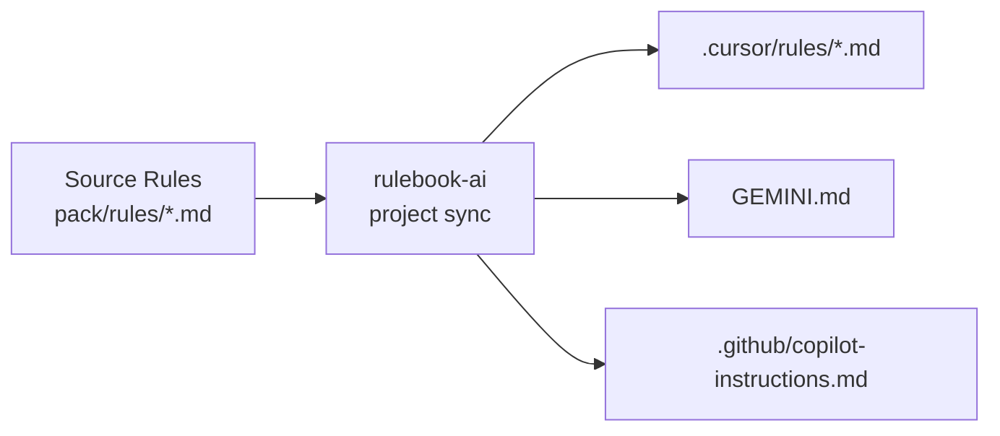

# Rule Structure and Organization

This page explains how rules are organized, loaded, and processed by Rulebook-AI and various AI assistants.

## Table of Contents

- [Overview](#overview)
- [File Organization](#file-organization)
- [Loading Mechanism](#loading-mechanism)
- [Rule File Format](#rule-file-format)
- [Assistant-Specific Generation](#assistant-specific-generation)
- [Rule Precedence](#rule-precedence)
- [File Naming Conventions](#file-naming-conventions)
- [Advanced Patterns](#advanced-patterns)

## Overview

Rules in Rulebook-AI follow a structured organization that:
1. Enables predictable loading order
2. Supports conditional application
3. Allows assistant-specific customization
4. Maintains composability across packs

### Key Concepts

- **Source Rules**: Markdown files in pack `rules/` directories
- **Generated Rules**: Assistant-specific format (e.g., `.cursor/rules/`, `GEMINI.md`)
- **Loading Order**: Alphanumeric by directory and filename
- **Frontmatter**: YAML metadata for rule behavior

## File Organization

### Pack Structure

```
pack-name/
└── rules/
    ├── 01-rules/              # Core rules directory
    │   ├── 00-meta-rules.md   # Loaded first
    │   ├── 01-memory.md       # Loaded second
    │   ├── 02-*.md            # Loaded third
    │   └── ...                # Continues in order
    ├── 02-rules-architect/    # Planning workflow
    │   └── 01-plan_v1.md
    ├── 03-rules-code/         # Implementation workflow
    │   └── 01-code_v1.md
    └── 04-rules-debug/        # Debugging workflow
        └── 01-debug_v1.md
```

### Directory Purposes

| Directory | Purpose | Loading |
|-----------|---------|---------|
| `01-rules/` | Core rules and context | Always loaded |
| `02-rules-architect/` | Planning workflow rules | Loaded when FOCUS = PLANNING |
| `03-rules-code/` | Implementation workflow rules | Loaded when FOCUS = IMPLEMENTATION |
| `04-rules-debug/` | Debugging workflow rules | Loaded when FOCUS = DEBUGGING |

### Why This Structure?

1. **Predictable Loading**: Numeric prefixes ensure consistent order
2. **Logical Grouping**: Related rules are together
3. **Conditional Application**: Workflow directories support focus-based loading
4. **Extensibility**: Easy to add new categories

## Loading Mechanism

### Sequential Loading

Rules are loaded in this order:

```
Step 1: Load 01-rules/ directory
  ├─ 00-meta-rules.md
  ├─ 01-memory.md
  ├─ 02-error-documentation.md
  ├─ 03-lessons-learned.md
  ├─ 04-archiecture-understanding.md
  ├─ 05-directory-structure.md
  └─ 06-rules_v1.md

Step 2: Determine FOCUS (via meta-rules)
  └─ PLANNING | IMPLEMENTATION | DEBUGGING

Step 3: Load workflow-specific directory
  ├─ If PLANNING → load 02-rules-architect/
  ├─ If IMPLEMENTATION → load 03-rules-code/
  └─ If DEBUGGING → load 04-rules-debug/
```

### Loading Algorithm

```python
# Pseudocode for rule loading
def load_rules(pack):
    rules = []
    
    # Step 1: Always load core rules
    core_rules = sort_alphanumeric(pack.rules['01-rules'])
    for rule in core_rules:
        rules.append(load_rule_file(rule))
    
    # Step 2: Determine focus from meta-rules
    focus = determine_focus(user_request, rules)
    
    # Step 3: Load workflow-specific rules
    if focus == PLANNING:
        workflow_rules = pack.rules['02-rules-architect']
    elif focus == IMPLEMENTATION:
        workflow_rules = pack.rules['03-rules-code']
    elif focus == DEBUGGING:
        workflow_rules = pack.rules['04-rules-debug']
    
    for rule in sort_alphanumeric(workflow_rules):
        rules.append(load_rule_file(rule))
    
    return rules
```

### Multi-Pack Loading

When multiple packs are active:

```
Pack 1 (light-spec):
  ├─ 01-rules/*.md → Loaded
  └─ 02-rules-architect/*.md → Loaded if FOCUS = PLANNING

Pack 2 (custom-pack):
  ├─ 01-rules/*.md → Loaded (merged after Pack 1)
  └─ 02-rules-architect/*.md → Loaded if FOCUS = PLANNING (merged after Pack 1)

Final rule set = Pack 1 rules + Pack 2 rules (in order)
```

## Rule File Format

### Basic Structure

```markdown
---
description: Brief description of what this rule does
globs: ["*.py", "*.js"]
alwaysApply: true
---

# Rule Title

Rule content in markdown format...

## Sections

- Subsections
- Instructions
- Examples
```

### Frontmatter (YAML)

The YAML frontmatter at the beginning of each file controls rule behavior:

```yaml
---
description: string           # Human-readable description
globs: [patterns]            # File patterns this rule applies to
alwaysApply: boolean         # Whether to always include this rule
customField: value           # Custom metadata (assistant-specific)
---
```

### Frontmatter Fields

#### `description` (string)

**Purpose**: Human-readable description of the rule  
**Required**: No (but recommended)  
**Usage**: Documentation and UI display

```yaml
---
description: ALWAYS INCLUDE to HAVE Project Context.
---
```

#### `globs` (array)

**Purpose**: File patterns for conditional application  
**Required**: No  
**Default**: `[]` (applies to all files)

**Examples**:
```yaml
# Python files only
globs: ["*.py", "**/*.py"]

# TypeScript in src directory
globs: ["src/**/*.ts", "src/**/*.tsx"]

# Multiple patterns
globs: ["*.js", "*.ts", "*.jsx", "*.tsx"]

# No patterns (always apply)
globs: []
```

**Pattern Syntax**:
- `*` - Matches any characters except `/`
- `**` - Matches any characters including `/`
- `?` - Matches single character
- `[abc]` - Matches any character in brackets

#### `alwaysApply` (boolean)

**Purpose**: Force rule to load regardless of context  
**Required**: No  
**Default**: `false`

```yaml
# Always load this rule
alwaysApply: true

# Load based on globs or other conditions
alwaysApply: false
```

**When to Use**:
- Core system rules (meta-rules, memory structure)
- Fundamental best practices
- Critical security guidelines

### Content Format

After frontmatter, use standard Markdown:

```markdown
# Main Heading

Brief introduction to the rule.

## Section 1: Concept

Explanation of the concept...

### Subsection

More detailed information...

## Section 2: Examples

```python
# Code example
def example():
    pass
```

## Section 3: Guidelines

- Guideline 1
- Guideline 2
- Guideline 3
```

### Markdown Features

Supported features:
- **Headers**: `#`, `##`, `###`
- **Lists**: Bulleted (`-`, `*`) and numbered (`1.`, `2.`)
- **Code blocks**: ` ```language` with syntax highlighting
- **Emphasis**: `**bold**`, `*italic*`
- **Links**: `[text](url)`
- **Mermaid diagrams**: ` ```mermaid`
- **Tables**: Markdown tables

## Assistant-Specific Generation

### Generation Process



### Output Formats

Different assistants require different formats:

| Assistant | Location | Format |
|-----------|----------|--------|
| **Cursor** | `.cursor/rules/*.md` | Individual markdown files |
| **Windsurf** | `.windsurf/rules/*.md` | Individual markdown files |
| **Cline** | `.clinerules/*.md` | Individual markdown files |
| **RooCode** | `.roo/rules/*.md` | Individual markdown files |
| **Kilo Code** | `.kilocode/rules/*.md` | Individual markdown files |
| **GitHub Copilot** | `.github/copilot-instructions.md` | Single concatenated file |
| **Gemini CLI** | `GEMINI.md` | Single concatenated file |
| **Claude Code** | `.claude/rules.md` | Single concatenated file |
| **Codex CLI** | `CODEX_RULES.md` | Single concatenated file |
| **Warp** | `.warp/rules.md` | Single concatenated file |

### Generation Examples

#### Individual Files (Cursor)

```bash
$ rulebook-ai project sync --assistant cursor

Generated:
.cursor/rules/
├── 00-meta-rules.md
├── 01-memory.md
├── 02-error-documentation.md
├── 03-lessons-learned.md
├── 04-archiecture-understanding.md
├── 05-directory-structure.md
├── 06-rules_v1.md
├── 07-plan_v1.md          # If FOCUS = PLANNING
├── 08-code_v1.md          # If FOCUS = IMPLEMENTATION
└── 09-debug_v1.md         # If FOCUS = DEBUGGING
```

#### Single File (GitHub Copilot)

```bash
$ rulebook-ai project sync --assistant copilot

Generated:
.github/copilot-instructions.md
  ├─ Combined content from all applicable rules
  ├─ Separated by headers
  └─ Single file for Copilot to read
```

### Sync Commands

```bash
# Default (Cursor)
rulebook-ai project sync

# Specific assistant
rulebook-ai project sync --assistant cursor
rulebook-ai project sync --assistant copilot
rulebook-ai project sync --assistant gemini

# Multiple assistants
rulebook-ai project sync --assistant cursor copilot windsurf

# All supported assistants
rulebook-ai project sync --all
```

## Rule Precedence

### Within a Pack

Rules are applied in alphanumeric order:

```
01-rules/
├── 00-meta-rules.md       # Priority 1
├── 01-memory.md           # Priority 2
├── 02-error-doc.md        # Priority 3
└── 10-custom.md           # Priority 4 (if exists)
```

Later rules can reference or override earlier rules.

### Across Packs

When multiple packs are loaded, rules are merged in pack addition order:

```bash
# Pack addition order
rulebook-ai packs add light-spec      # Priority 1
rulebook-ai packs add custom-pack     # Priority 2

# Rule loading order
1. light-spec/01-rules/*.md
2. custom-pack/01-rules/*.md
3. light-spec/02-rules-architect/*.md (if PLANNING)
4. custom-pack/02-rules-architect/*.md (if PLANNING)
```

**Implication**: Later packs can:
- Add new rules
- Extend existing rules
- Override previous rules (by providing additional context)

### Override Patterns

**Additive Override** (Recommended):
```markdown
# In custom-pack/01-rules/10-additional-context.md
---
description: Additional project-specific guidelines
alwaysApply: true
---

# Additional Guidelines

These extend the core rules from light-spec:

- Project-specific convention 1
- Project-specific convention 2
```

**Replacement Override** (Use Carefully):
```markdown
# In custom-pack/01-rules/00-meta-rules.md
---
description: Custom meta-rules that replace default behavior
alwaysApply: true
---

# Custom Meta-Rules

This replaces the default meta-rules with custom focus logic...
```

## File Naming Conventions

### Numeric Prefixes

Use two-digit prefixes for clear ordering:

```
Good:
├── 00-meta-rules.md
├── 01-memory.md
├── 02-error-documentation.md
└── 10-custom-rule.md

Avoid:
├── 1-memory.md          # Single digit sorts incorrectly
├── meta-rules.md        # No number, unpredictable order
└── z-custom.md          # Alphabetic, hard to manage
```

### Descriptive Names

Use clear, descriptive names:

```
Good:
├── 01-memory.md
├── 02-error-documentation.md
├── 03-lessons-learned.md

Avoid:
├── 01-mem.md            # Abbreviated
├── 02-err.md            # Unclear
├── 03-stuff.md          # Vague
```

### Version Suffixes

Include version when multiple versions exist:

```
├── 01-plan_v1.md
├── 01-plan_v2.md        # If needed
└── 01-code_v1.md
```

### Directory Naming

Standard directory names:

```
Recommended:
├── 01-rules/            # Core rules
├── 02-rules-architect/  # Planning
├── 03-rules-code/       # Implementation
└── 04-rules-debug/      # Debugging

Custom (if needed):
├── 01-rules/
├── 02-rules-architect/
├── 03-rules-code/
├── 04-rules-debug/
└── 05-rules-custom/     # Additional workflow
```

## Advanced Patterns

### Conditional Loading

Use frontmatter for conditional loading:

```yaml
---
description: Python-specific testing rules
globs: ["**/test_*.py", "**/*_test.py"]
alwaysApply: false
---

# Python Testing Rules

These rules only apply when working with Python test files...
```

### Workflow Extensions

Add custom workflow directories:

```
rules/
├── 01-rules/
├── 02-rules-architect/
├── 03-rules-code/
├── 04-rules-debug/
└── 05-rules-review/      # Custom: Code review workflow
    └── 01-review_v1.md
```

Then extend meta-rules to use it:

```markdown
# In custom meta-rules
FOCUS = REVIEW → Load 05-rules-review/
```

### Modular Rules

Split large rules into smaller, focused files:

```
Instead of:
├── 06-all-principles.md  # 1000+ lines

Use:
├── 06-principles-code-quality.md
├── 07-principles-security.md
├── 08-principles-testing.md
└── 09-principles-performance.md
```

### Hierarchical Rules

Create rule hierarchies with includes:

```markdown
# 06-principles-main.md
---
description: Main principles file
alwaysApply: true
---

# Core Principles

See also:
- [Code Quality Principles](mdc:/rules/06-principles-code-quality.md)
- [Security Principles](mdc:/rules/07-principles-security.md)
```

### Dynamic Rule Selection

Use meta-rules to dynamically select rules:

```markdown
# In meta-rules
If project type == "web":
    Apply web-specific rules
Elif project type == "data":
    Apply data-science rules
Else:
    Apply general rules
```

## Rule Development Best Practices

### 1. Start Simple

Begin with minimal rules and expand as needed:

```markdown
# v1 - Minimal
# Rule Title
- Guideline 1
- Guideline 2

# v2 - Expanded (only if needed)
# Rule Title
## Context
## Guidelines
## Examples
```

### 2. Use Clear Hierarchies

Structure rules with clear sections:

```markdown
# Rule Title

## Overview
Brief introduction...

## Core Concepts
Key concepts...

## Guidelines
- Guideline 1
- Guideline 2

## Examples
Example code...

## Common Pitfalls
What to avoid...
```

### 3. Reference Other Rules

Link related rules:

```markdown
# Implementation Rules

Before implementing, ensure you've followed the [Planning Rules](../02-rules-architect/01-plan_v1.md).

After implementation, update the [Memory Files](01-memory.md).
```

### 4. Version Rules

Version rules when making significant changes:

```
├── 01-plan_v1.md        # Original
├── 01-plan_v2.md        # Updated version
└── 01-plan.md           # Symlink to latest (optional)
```

### 5. Document Rule Purpose

Always include clear descriptions:

```yaml
---
description: |
  This rule guides the AI through the planning phase,
  ensuring thorough analysis before implementation.
alwaysApply: false
---
```

## Troubleshooting

### Rule Not Loading

**Check**:
1. File is in correct directory
2. Filename starts with numeric prefix
3. File has `.md` extension
4. Frontmatter is valid YAML

### Wrong Rule Loading

**Check**:
1. Focus determination in meta-rules
2. `alwaysApply` setting
3. `globs` patterns match your files

### Rules Conflicting

**Solutions**:
1. Check pack loading order
2. Use more specific file patterns
3. Adjust numeric prefixes
4. Remove conflicting packs

### Assistant Not Recognizing Rules

**Check**:
1. Ran `project sync` for that assistant
2. Assistant is supported
3. Generated files are in correct location
4. Assistant is configured to use rules

---

**Next**: Explore [Advanced Topics](Advanced-Topics.md) for pack development and customization, or return to [Rules Categories](Rules-Categories.md) for detailed category information.
