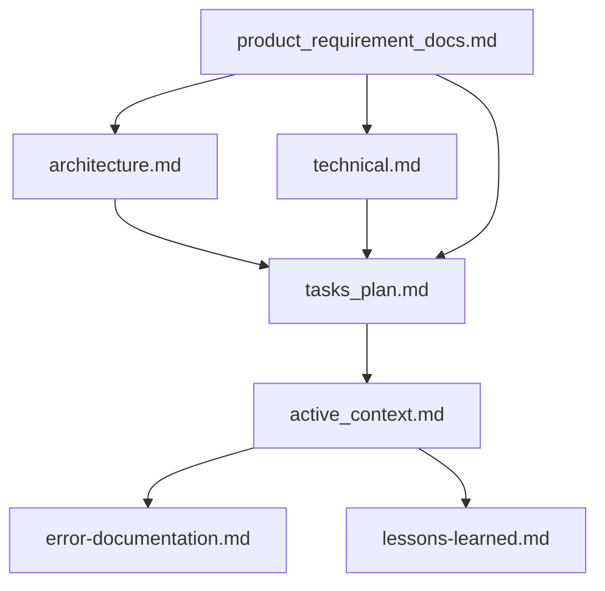
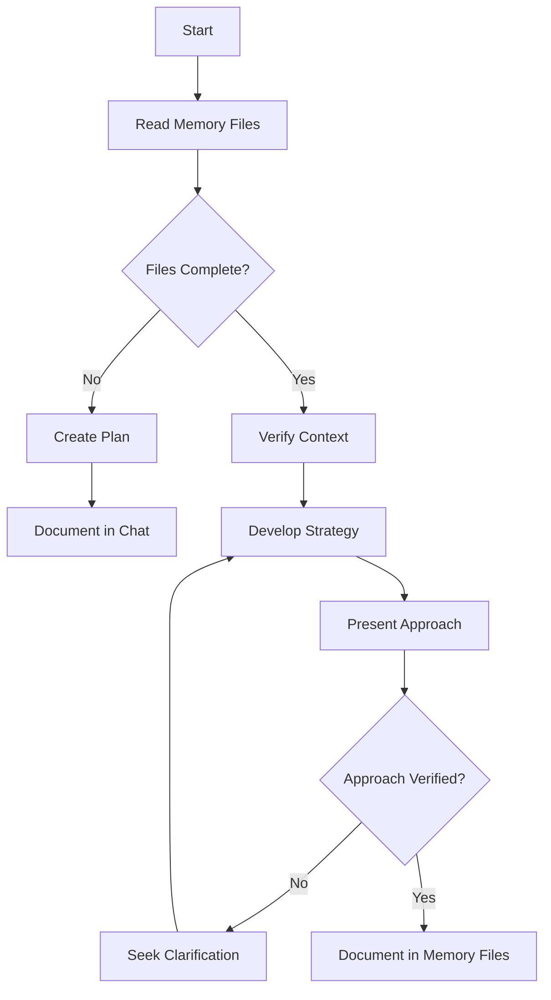
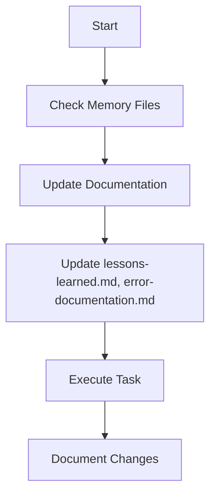
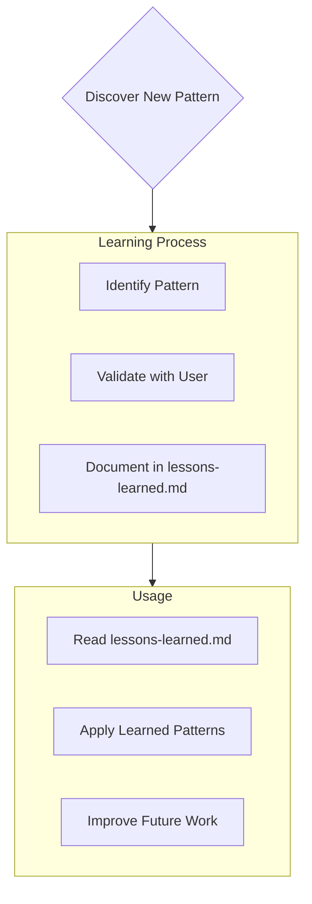
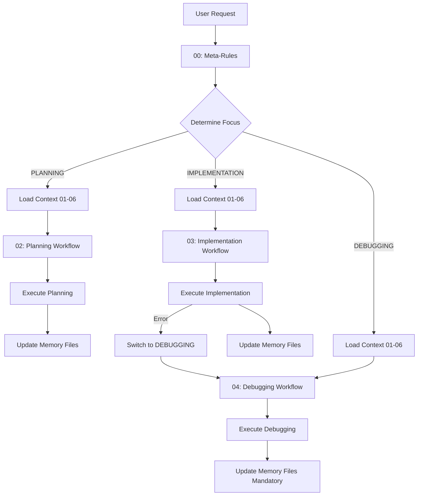

# Rules Categories and Groupings

This page provides comprehensive documentation of all rule categories, their purposes, and how they work together to create an effective AI environment.

## Table of Contents

- [Overview](#overview)
- [Rule Organization](#rule-organization)
- [Core Rules Directory (01-rules)](#core-rules-directory-01-rules)
- [Workflow-Specific Rules](#workflow-specific-rules)
- [Rule Categories Deep Dive](#rule-categories-deep-dive)
- [How Rules Work Together](#how-rules-work-together)
- [Rule Frontmatter](#rule-frontmatter)

## Overview

Rules in Rulebook-AI are organized into **categories** and **groupings** that serve different purposes:

1. **Core Rules** (`01-rules/`): Foundational instructions and project context
2. **Workflow Rules**: Specialized instructions for specific modes (Planning, Implementation, Debugging)

This organization allows AI assistants to:
- Load appropriate context based on the task
- Follow systematic workflows
- Maintain consistency across different operations
- Adapt behavior based on project needs

## Rule Organization

### Directory Structure

```
rules/
├── 01-rules/                    # Core rules (always loaded)
│   ├── 00-meta-rules.md        # [Category: Meta] Focus & mode determination
│   ├── 01-memory.md            # [Category: Memory] Memory Bank structure
│   ├── 02-error-documentation.md # [Category: Memory] Error tracking
│   ├── 03-lessons-learned.md   # [Category: Memory] Learning journal
│   ├── 04-archiecture-understanding.md # [Category: Context] Architecture
│   ├── 05-directory-structure.md # [Category: Context] Project structure
│   └── 06-rules_v1.md          # [Category: Principles] Best practices
├── 02-rules-architect/          # Planning workflow
│   └── 01-plan_v1.md           # [Category: Workflow] Planning process
├── 03-rules-code/               # Implementation workflow
│   └── 01-code_v1.md           # [Category: Workflow] Coding process
└── 04-rules-debug/              # Debugging workflow
    └── 01-debug_v1.md          # [Category: Workflow] Debug process
```

### Loading Order

Rules are loaded in this sequence:

1. **Meta-Rules** (00): System-level instructions
2. **Context Rules** (01-05): Project context and memory
3. **Principles** (06): General best practices
4. **Workflow Rules** (02-04 directories): Task-specific workflows

The AI determines which workflow rules to apply based on the current task focus.

## Core Rules Directory (01-rules)

These rules are **always loaded** and provide the foundation for all AI operations.

### 00: Meta-Rules

**Category**: System Meta-Instructions  
**Purpose**: Determines operational focus and applicable rule sets  
**Always Applied**: Yes

**Key Concepts**:
- **Focus Determination**: Decides whether task is PLANNING, IMPLEMENTATION, or DEBUGGING
- **Mode Logic**: Manages interaction between user commands and AI internal states
- **Rule Application Hierarchy**: Defines which rules apply when

**Decision Hierarchy**:
1. Explicit user command (`FOCUS = PLANNING`)
2. Inferred task intent from request
3. AI assistant's internal state (if applicable)

**Example Scenarios**:
```
User: "Let's redesign the authentication system"
→ FOCUS = PLANNING (applies 02-rules-architect/)

User: "Implement the login endpoint"
→ FOCUS = IMPLEMENTATION (applies 03-rules-code/)

User: "Fix the 500 error on /api/users"
→ FOCUS = DEBUGGING (applies 04-rules-debug/)
```

### 01: Memory Structure

**Category**: Memory Bank System  
**Purpose**: Defines the project's documentation structure and workflow  
**Always Applied**: Yes  
**Core Concept**: Memory Bank

**Memory Files Hierarchy**:



**Seven Core Files**:

1. **product_requirement_docs.md** - Product requirements and scope
   - Why the project exists
   - Problems it solves
   - Core requirements

2. **architecture.md** - System architecture
   - Component relationships
   - Dependencies
   - Design decisions

3. **technical.md** - Development environment
   - Technology stack
   - Development setup
   - Technical constraints

4. **tasks_plan.md** - Task backlog
   - Project progress
   - What works
   - What's left to build

5. **active_context.md** - Current state
   - Current work focus
   - Active decisions
   - Recent changes

6. **error-documentation.md** - Error tracking
   - Known issues
   - Resolution strategies
   - Debugging history

7. **lessons-learned.md** - Learning journal
   - Patterns discovered
   - Project intelligence
   - User preferences

**Operational Modes**:

**PLAN/Architect Mode**:


**ACT/Code Mode**:


### 02: Error Documentation

**Category**: Memory Bank - Error Tracking  
**Purpose**: Document failures and resolutions for future reference  
**Always Applied**: Yes

**When to Update**:
- After fixing a bug
- Discovering a workaround
- Encountering a recurring issue
- Learning from a mistake

**Information to Capture**:
- Error description
- Context when it occurred
- Root cause analysis
- Resolution steps
- Prevention strategies

### 03: Lessons Learned

**Category**: Memory Bank - Project Intelligence  
**Purpose**: Learning journal capturing patterns and preferences  
**Always Applied**: Yes

**What to Capture**:
- Critical implementation paths
- User preferences and workflow
- Project-specific patterns
- Known challenges
- Tool usage patterns
- Evolution of decisions

**Usage Pattern**:


### 04: Architecture Understanding

**Category**: Project Context  
**Purpose**: Guidelines for understanding and respecting project architecture  
**Always Applied**: Yes

**Key Responsibilities**:
- Understand component relationships
- Respect architectural decisions
- Identify when changes affect architecture
- Document architectural impacts

### 05: Directory Structure

**Category**: Project Context  
**Purpose**: Understanding project organization and file locations  
**Always Applied**: Yes

**Typical Coverage**:
- Source code organization
- Test file locations
- Configuration files
- Build artifacts
- Documentation structure

### 06: General Best Practices

**Category**: Core Principles  
**Purpose**: Foundational software engineering principles  
**Always Applied**: Yes

**Core Principles**:

#### I. Core Operational Principles
- **Clarity First**: Seek clarification on ambiguities
- **Context is Key**: Gather relevant context before work
- **Structured Interaction**: Clear, organized responses
- **Use Resources Wisely**: Prioritize internal context

#### II. Foundational Software Engineering
- **High-Quality Code**: Clarity, simplicity, consistency, DRY
- **Robust Systems**: Input validation, error handling, edge cases
- **Testability**: Pure functions, dependency injection
- **Security**: Treat input as untrusted, prevent injections
- **Documentation**: Explain the "Why", document public APIs
- **Performance**: Avoid obvious inefficiencies

#### III. Tool Integration
- LLM API usage
- Web scraping
- Search engine integration
- Screenshot verification

**Example Sections**:
```markdown
## I. Core Principles
- Clarity First
- Context is Key
- Structured Interaction

## II. Foundational Software Engineering
- Write High-Quality, Maintainable Code
- Build Robust & Resilient Systems
- Ensure Testability
- Prioritize Security
- Document Effectively
- Consider Performance

## III. Tools
- LLM Integration
- Web Browser
- Search Engine
```

## Workflow-Specific Rules

These rules are applied **conditionally** based on the determined FOCUS.

### Planning Workflow (02-rules-architect)

**Directory**: `02-rules-architect/`  
**Applied When**: FOCUS = PLANNING  
**Purpose**: Guide high-level design and solution proposal

**Process Steps**:
1. **Understand & Contextualize**
   - Achieve clarity on requirements
   - Leverage project context
   - State constraints and assumptions

2. **Design & Justify**
   - Explore solutions
   - Evaluate trade-offs
   - Select optimal solution

3. **Detail Plan**
   - Code changes/additions
   - Necessary tests
   - Documentation needs
   - Dependencies

4. **Assess & Validate**
   - Note Memory Bank impacts
   - Present plan clearly
   - Request human approval

**Key Outputs**:
- Detailed implementation plan
- Trade-off analysis
- Justification for approach
- Required resources identified

### Implementation Workflow (03-rules-code)

**Directory**: `03-rules-code/`  
**Applied When**: FOCUS = IMPLEMENTATION  
**Purpose**: Execute approved plans with quality and consistency

**Process Steps**:
1. **Prepare & Validate**
   - Confirm understanding of plan
   - Verify alignment with context
   - Halt on conflicts

2. **Implement & Iterate**
   - Execute plan steps
   - Apply best practices
   - Self-correct issues

3. **Test & Document**
   - Implement tests
   - Run test suite
   - Add documentation

4. **Report & Update**
   - Report completion status
   - Update Memory Files
   - Document changes

**Key Outputs**:
- Working implementation
- Test coverage
- Updated documentation
- Memory Bank updates

### Debugging Workflow (04-rules-debug)

**Directory**: `04-rules-debug/`  
**Applied When**: FOCUS = DEBUGGING  
**Purpose**: Diagnose and fix errors systematically

**Process Steps**:
1. **Understand & Contextualize**
   - Gather error details
   - Check Memory Files
   - Reproduce if possible

2. **Analyze & Hypothesize**
   - Analyze failure
   - Formulate root causes
   - Use project context

3. **Identify Cause & Plan Fix**
   - Pinpoint root cause
   - Plan minimal fix
   - Note documentation issues

4. **Implement & Verify**
   - Apply fix
   - Run tests
   - Verify resolution

5. **Report & Update**
   - Report outcome
   - Update error-documentation.md (mandatory)
   - Update other Memory Files

**Key Outputs**:
- Root cause analysis
- Fix implementation
- Updated error documentation
- Test verification

## Rule Categories Deep Dive

### Meta Category

**Files**: `00-meta-rules.md`  
**Purpose**: System-level control and focus determination

**Responsibilities**:
- Determine operational focus
- Manage mode transitions
- Apply appropriate rule sets
- Handle mode conflicts

**Key Concepts**:
- Focus determination hierarchy
- Mode logic preservation
- Cross-check mechanisms

### Memory Category

**Files**: `01-memory.md`, `02-error-documentation.md`, `03-lessons-learned.md`  
**Purpose**: Project knowledge management

**Core Concepts**:
- Memory Bank structure
- Seven core files
- Update workflows
- Learning capture

**Update Triggers**:
- Discovering new patterns
- After significant changes
- User requests "update memory files"
- Context needs clarification
- Plan verification

### Context Category

**Files**: `04-archiecture-understanding.md`, `05-directory-structure.md`  
**Purpose**: Project-specific context and structure

**Responsibilities**:
- Understand project organization
- Respect architectural decisions
- Navigate codebase effectively
- Identify structural impacts

### Principles Category

**Files**: `06-rules_v1.md`  
**Purpose**: Software engineering best practices

**Coverage Areas**:
- Code quality
- System robustness
- Testing
- Security
- Documentation
- Performance
- Tool integration

### Workflow Category

**Directories**: `02-rules-architect/`, `03-rules-code/`, `04-rules-debug/`  
**Purpose**: Task-specific operational procedures

**Three Workflows**:
1. **Planning**: Design and proposal
2. **Implementation**: Execution and coding
3. **Debugging**: Diagnosis and fixing

## How Rules Work Together

### Example: Implementing a New Feature

1. **User Request**: "Add user authentication"

2. **Meta-Rules Apply** (00):
   - Analyzes request
   - Determines: FOCUS = PLANNING (design phase)

3. **Context Loaded** (01-06):
   - Reads Memory Bank files
   - Checks architecture.md
   - Reviews technical.md
   - Examines lessons-learned.md

4. **Planning Workflow** (02-rules-architect):
   - Understands requirements
   - Designs solution
   - Considers trade-offs
   - Creates detailed plan
   - Requests approval

5. **User Approves**: "Looks good, implement it"

6. **Meta-Rules Re-evaluate**:
   - New request analyzed
   - Determines: FOCUS = IMPLEMENTATION

7. **Implementation Workflow** (03-rules-code):
   - Validates plan against context
   - Implements code
   - Writes tests
   - Documents changes
   - Updates Memory Files

8. **If Error Occurs**:
   - Meta-Rules detect failure
   - Switches to: FOCUS = DEBUGGING
   - Debugging Workflow applied (04-rules-debug)

### Example: Fixing a Bug

1. **User Request**: "Fix the 500 error on login"

2. **Meta-Rules Apply** (00):
   - Analyzes request
   - Determines: FOCUS = DEBUGGING

3. **Context Loaded** (01-06):
   - Reads error-documentation.md
   - Checks relevant Memory Files
   - Reviews architecture/technical docs

4. **Debugging Workflow** (04-rules-debug):
   - Gathers error details
   - Analyzes with context
   - Identifies root cause
   - Plans fix
   - Implements and verifies
   - **Mandatory**: Updates error-documentation.md
   - Updates other relevant Memory Files

### Rule Interaction Flow



## Rule Frontmatter

Rules can include YAML frontmatter for metadata:

```yaml
---
description: Brief description of the rule
globs: ["*.py", "*.js"]  # File patterns this rule applies to
alwaysApply: true         # Whether to always load this rule
---
```

### Frontmatter Fields

| Field | Type | Purpose | Example |
|-------|------|---------|---------|
| `description` | string | Rule description | "ALWAYS INCLUDE to HAVE Project Context" |
| `globs` | array | File patterns | `["*.py", "src/**/*.ts"]` |
| `alwaysApply` | boolean | Load unconditionally | `true` |

### Usage Examples

**Always-Apply Rule**:
```yaml
---
description: ALWAYS INCLUDE to HAVE Project Context.
globs: []
alwaysApply: true
---
```

**Pattern-Specific Rule**:
```yaml
---
description: Python-specific coding standards
globs: ["*.py", "**/*.py"]
alwaysApply: false
---
```

## Rule Customization by Pack

Different packs implement the same categories with varying levels of detail:

| Category | Light-Spec | Medium-Spec | Heavy-Spec |
|----------|------------|-------------|------------|
| Meta-Rules | Concise | Balanced | Very detailed |
| Memory | Core structure | Enhanced guidance | Extensive procedures |
| Principles | Essential practices | Expanded practices | Comprehensive standards |
| Workflows | Streamlined steps | Detailed steps | Highly prescriptive |

**Example Progression**:

**Light-Spec Planning**:
```markdown
1. Understand & Contextualize
2. Design & Justify
3. Detail Plan
4. Assess & Validate
```

**Medium-Spec Planning**:
```markdown
1. Understand & Contextualize (with validation checks)
2. Design & Justify (with explicit trade-off analysis)
3. Detail Plan (with dependency mapping)
4. Assess & Validate (with impact analysis)
```

**Heavy-Spec Planning**:
```markdown
1. Understand & Contextualize
   a. Gather requirements
   b. Validate completeness
   c. Document assumptions
   d. Identify constraints
2. Design & Justify
   a. Explore alternatives
   b. Detailed trade-off matrix
   c. Risk assessment
   d. Architecture impact analysis
3. Detail Plan
   [Even more detailed breakdown]
4. Assess & Validate
   [Comprehensive validation procedures]
```

## Best Practices for Using Rules

### 1. Start with Light-Spec
Begin with the lightest pack that meets your needs. You can always upgrade to medium-spec or heavy-spec if needed.

### 2. Trust the Focus Determination
The meta-rules are designed to determine the correct focus. Trust the system unless you have a specific override need.

### 3. Maintain Memory Files
Keep the seven core Memory Bank files updated. They're the foundation for context-aware AI behavior.

### 4. Use Explicit Focus When Needed
If the AI isn't using the right workflow, use explicit commands:
- `FOCUS = PLANNING`
- `FOCUS = IMPLEMENTATION`
- `FOCUS = DEBUGGING`

### 5. Update Error Documentation
Always update `error-documentation.md` after fixing bugs. This prevents recurring issues.

### 6. Capture Lessons Learned
Document patterns and insights in `lessons-learned.md`. This improves AI effectiveness over time.

---

**Next**: Learn about [Rule Structure](Rule-Structure.md) to understand how rules are loaded and processed, or explore [Advanced Topics](Advanced-Topics.md) for customization.
